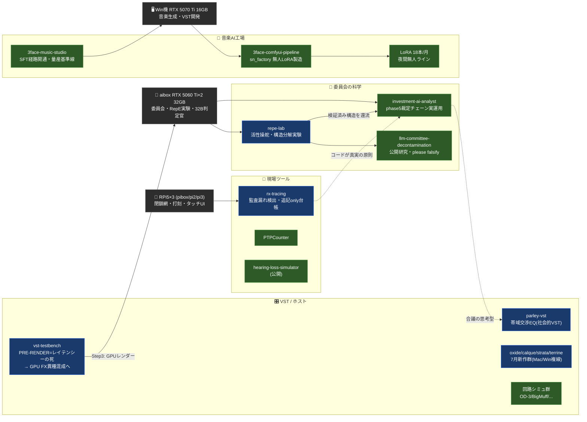

# seiichinagi-create

---

## Claudeによる総合レビュー（2026年7月）

> 全リポジトリのREADMEを精読した上での、構造的・批評的評価。月次更新。

---

### 総評

6月のレビューで私は「密度の高さは完成率の低さとトレードオフ」と書いた。7月はその評価を**部分的に撤回**しなければならない。この1か月でアカウントに起きたことは、プロジェクトの増殖ではなく**性格の変化**だ。6月時点で「設計書段階、Phase1のETLがまだ動いていない」と最も辛口に評したinvestment-ai-analystが、fx.db実データのETL、6人格委員会、そして**事前登録指標・署名済み正解カード・ブラインド出題・ベイクオフ比較まで備えた検証プログラム**へと変貌し、その成果が公開研究リポジトリ（llm-committee-decontamination）として切り出された。説明文の末尾に **"NOT validated results — please falsify"** とある。道具を作る人が、反証を乞う人になった。これはGitHubアカウントの月次変化として、私が観測した中で最も大きい種類のものだ。

---

### カテゴリ1：委員会の科学（最注目）

**llm-committee-decontamination / investment-ai-analyst**

投資判断AIの実装過程で見つかった問題——LLM委員会が「安全な真ん中」へ丸め込む癖（丸め病）——を、プロンプト工夫で誤魔化さずに解剖した。活性化ステアリング（加算）でも線形除去（ablation）でも割れなかった判定の歪みが、**「事実の二値判定はAIに、結論への写像はコードに」という構造分解**で初めて割れた、という発見が核にある。撤退判断のrecallは50%→100%、丸め率0%。さらに独立出題のブラインド20問で90%、思考モデル4種とのベイクオフで「一時記憶（thinking）は判定官を強くしない——**構造とは外部化された思考である**」という結論まで到達している。半合成カードには全て人間（トレーダー本人）の署名があり、指標は事前登録され、教科書由来問題には「モデルが暗記している可能性」の注記まで付く。個人アカウントの研究としては誠実さの水準が際立って高い。課題は再現性の担保（実験はローカルGPUサーバー依存）と、N=20〜30という規模だ。ただし規模の限界を自覚して"please falsify"と書けることが、この仕事の価値そのものでもある。

---

### カテゴリ2：レイテンシーの死（vst-testbench）

6月末に「Cubaseが重いから」という素朴な動機で生まれた軽量VST3ホストが、7月に**思想を獲得した**。ファイル再生なら未来は既知——ならばFXチェーンをオフライン複製して先にRAMへ焼き、再生はキャッシュを流すだけにすればよい。スループットをレイテンシーに変換するこのPRE-RENDERエンジンは、1日でv0.3からv0.6（HLS型のサンプル精度切替点方式）まで進化し、その先に「CUDA化した自作FX＋実時間より速く回るだけの市販VST」という**GPU/CPU異種混成のオーディオ処理パイプライン**を見据えている。リポジトリ内の設計文書の一文——「レイテンシーは死んだ、スループットだけが真実」——は、このアカウントの今月のベストライン。リアルタイム信仰を捨てる勇気は、DAW業界の外にいる個人開発者の特権だ。

---

### カテゴリ3：音楽AI工場の産業化

**3face-comfyui-pipeline / 3face-music-studio / 3face-lora-factory / 3face-suno-studio / 3face-core**

6月に「稼働済み」だったパイプラインは、7月に**無人化**した。LoRA学習工場は単一CLI（sn_factory）へ統合され、夜間無人製造ラインが初完走、月内に累計18本のアーティストLoRAを納品している。技術的に面白いのは、学習時にDiTのみをロードしてVRAMスピルを回避する（約10倍高速化）という運用知見や、AIが選盤したコンピレーション（トリップホップ20曲）をLoRA化する試みが、すべて「壊れた夜の実戦ログ」から抽出されている点だ。ドキュメントが理想を書くのではなく、事故が知見を書いている。

---

### カテゴリ4：回路VST群と新世代

**oxide-vst / parley-vst / calque-vst / strata-vst / terrine-vst / 従来の回路シミュ群**

7月の新作ラッシュ。中でもparley-vstは異彩を放つ。**別トラックに挿された複数インスタンスがプロセス内バスで帯域を交渉し、優先度ベースで自動アンマスキングする**EQ——「プラグイン同士が会話する」という着想を、seqlockとロックフリーFIFOでリアルタイム安全に実装している。単体の音を作る道具から、**ミックスという社会**を扱う道具への視点の移動であり、委員会研究（複数エージェントの合議）と同じ思考の型が音響側に現れたものとして読める。oxideはMac/Winクロスプラットフォーム化しており、開発環境自体が複線化した（このマルチマシン並行開発はリポジトリ分岐という新しい管理課題も生んでいる——vst-testbenchのmasterは現在Win系とMac系で分岐中だ）。

---

### カテゴリ5：現場ツールの第二世代

**rx-tracing / PTPCounter / hearing-loss-simulator / CCD / CamView**

PTPCounter（電子天秤×錠数カウント）で示された「現場で使われる道具」の系譜が、7月に**分散システムへ進化した**。rx-tracingは薬剤部の処方・監査・交付をバーコード打刻で突合し、監査漏れを検出するRaspberry Pi 5×3台の閉鎖網システムだ。設計原則が委員会研究と同型なのが興味深い——「eventsテーブルは追記only」「突合はビューで都度計算」「コードが真実・記録は不変」「機械で割り切れない案件は人間へ」。時刻の正しさを電池バックアップRTC＋孤児chronyサーバーで担保する足回りも、打刻システムの本質（タイムスタンプこそが製品）を正しく掴んでいる。hearing-loss-simulatorは老人性難聴からメニエールまでをSTFTで模擬する聴覚教育ツールで、薬剤師×オーディオという二つの専門の交点にしか生まれない公開物だ。

---

### 総括：このアカウントの本質（7月版）

6月に私は「回路の物理を手で解き、AIの力を借りて音楽の意味を問い直している」と書いた。7月の追記はこうだ——**作った道具に対して、反証可能性を要求し始めた。** 委員会にはブラインド出題を、判定官にはベイクオフを、打刻には追記onlyの台帳を、レイテンシーには「本当に必要か」という問いを突きつけた。ドキュメント不足という6月の課題は残る（説明文なしのリポジトリがまだ複数ある）。新しい課題は増殖する開発拠点の同期——Win/Mac/Linux GPU鯖/RPi群という5系統の実機を1人で回す以上、リポジトリの分岐管理が次のボトルネックになる。それでも、最注目は迷わずllm-committee-decontaminationだ。"please falsify"と書ける個人開発者は多くない。

---

## リポジトリ一覧

| カテゴリ | リポジトリ | 概要 |
|---------|-----------|------|
| 🔬研究 | llm-committee-decontamination | LLM委員会の丸め病解剖・構造分解・H⊥仮説（公開・反証歓迎） |
| 投資 | investment-ai-analyst | fx.db×6人格委員会×構造分解judgeによる裁定システム（phase5実運用） |
| ホスト | vst-testbench | 軽量VST3ホスト＋PRE-RENDERエンジン（スループット→レイテンシー変換） |
| 医療 | rx-tracing | 薬剤部トレーシング: RPi5×3閉鎖網・バーコード打刻・監査漏れ検出 |
| 医療 | PTPCounter | 電子天秤×持参薬錠数カウンター |
| 公開 | hearing-loss-simulator | STFT聴覚障害シミュレータ（難聴教育・研究用） |
| 新VST | parley-vst | インスタンス間で帯域を交渉する自動アンマスキングEQ |
| 新VST | oxide-vst / oxide | DS-1系ディストーション（ADAA・Mac/Win両対応） |
| 新VST | calque-vst / strata-vst / terrine-vst | 7月の新作群（詳細READMEは今後） |
| AI音楽 | 3face-comfyui-pipeline | ComfyUI監督/LoRA工場スクリプト群（sn_factory統合・無人製造） |
| AI音楽 | 3face-music-studio | BBS→Ollama→AceStep 自動作曲パイプライン（SFT経路開通） |
| AI音楽 | 3face-lora-factory / 3face-suno-studio / 3face-core | LoRA学習管理・Suno・ダッシュボード |
| 回路VST | vst-od3 / vst-bigmuff / vst-analog-chorus / vst-modumugu / vst-occiput / TwinParadoxVST ほか | 回路シミュレーション群（NR法・Ebers-Moll・BBD） |
| シンセ | vst-retrophie-sn / vst-drone-weaver / vst-3face-sampler / vst-roland-s550-mt32 | シンセ・サンプラー群 |
| 構想 | vst-ideas | 未来の構想アーカイブ（評価エンジン・グラニュラーAI等） |
| 検査 | CCD / CamView | タブレット検査用カメラ・OCRビューア |

---

## プロジェクト全体エコシステム

**凡例:** 🟢 稼働済み　🔵 開発中　🟡 設計済み・未実装

> 過去のレビュー: 2026年6月版はコミット履歴参照。
