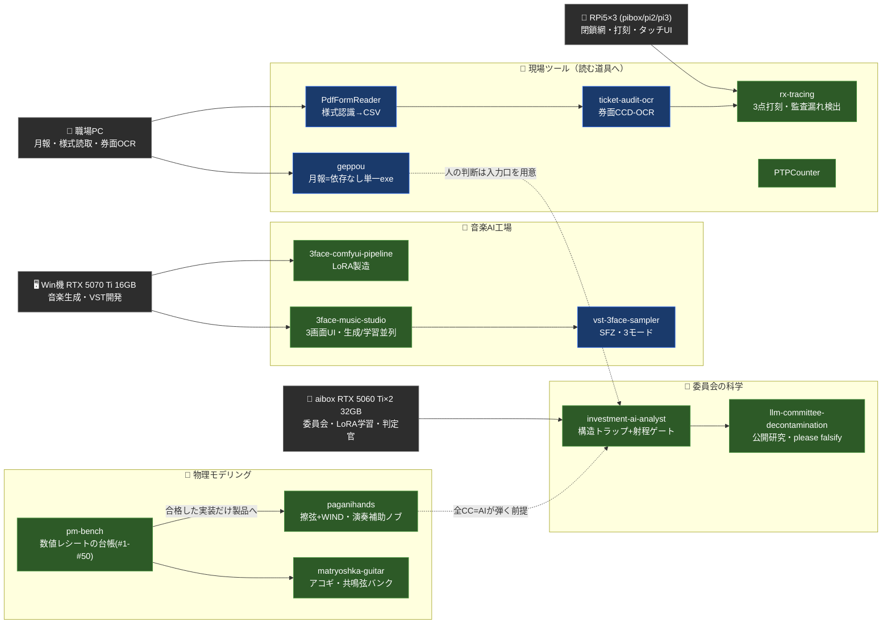

# seiichinagi-create

---

## Claudeによる総合レビュー（2026年8月）

> 全リポジトリのREADMEを精読した上での、構造的・批評的評価。月次更新。

---

### 総評

7月のレビューで私は「作った道具に対して、反証可能性を要求し始めた」と書いた。8月に入って観測されるのは、その要求が**道具づくりの外側——自分の労働そのもの**へ向き始めたことだ。今月このアカウントに現れた新顔は、PDFの様式を読む道具（PdfFormReader）、引換券を読む道具（ticket-audit-ocr）、そして紙の月報を作る道具（geppou）である。いずれも「人が読んで、人が写す」という工程を機械に移す装置だ。同時に、物理モデリングの試作ベンチ（pm-bench）が**2つの楽器を産んで自らは資料室になった**。検証装置が製品を吐き、業務が道具に置き換わる。7月が「反証」の月なら、8月は**清算**の月である。

ただし、今月は批評として言うべきことが一つある。**このアカウントは、もう本人の実態を映していない。** 45リポジトリのうち公開は5本。そして主力の何本かはGitHubに存在しない（NAS側が正）。外から見える像と、実際に動いている開発の重心が、月ごとにずれ続けている。

---

### カテゴリ1：ベンチが楽器を産んだ（pm-bench → paganihands / matryoshka-guitar）

**pm-bench** は物理モデリング音源の先行検討ベンチで、全出力がオフラインWAV、リアルタイムなし。ここに書かれている数字が良い。可換性の実証は「共振→IR畳み込み」と「(励起⊛IR)→共振」のヌルが **-239dB peak**、時変ピッチEGを入れるとヌルが+1.9dBに悪化して**可換化が破れる境界が実測される**。ピック位置β=0.5でH2が隣接比-26.8dB、これはコム理論値と一致する。**主張ではなく受領証（レシート）で書かれた設計文書**であり、DSPの個人開発でこの書き方を見ることは稀だ。

そして今月、このベンチは6サイクル・#1〜#50で閉じられ、成果が2つの製品に落ちた。**paganihands**（擦弦＋WINDのモノフォニック物理音源。息と弓のサーボを連続ノブにした「Assist」、約3秒周期のフレーズ弧を運ぶ「Auto-play」）と、**matryoshka-guitar**（KS拡張撥弦8ボイス＋モーダルボディ＋共鳴弦バンク、プリセット32、モーリス風ボディにノブを散らしたUI）。両方とも**全パラメータMIDI CC対応**で、READMEには「AI自走演奏がぐりぐりできる」と書いてある。楽器を人間のために作りながら、演奏者としてAIを想定している。この二重性は今月いちばん面白い設計思想だ。

共鳴弦バンクに付された注記——**「受動注入のみ＝轟音鉄則」**——は、フィードバック系DSPで自己発振を出した者にしか書けない一行である。

---

### カテゴリ2：読み取りの自動化（PdfFormReader / ticket-audit-ocr / geppou）

現場ツールは第三世代に入った。第一世代は測る道具（PTPCounter＝電子天秤で錠数を数える）、第二世代は突合する道具（rx-tracing＝3点打刻で監査漏れを検出）、そして第三世代は**読む道具**だ。

**PdfFormReader** は、PDFをドラッグで領域定義し、アンカー方式で文書種を判定して項目をCSVに落とす汎用ツール（C++20/JUCE 8）。設計判断が正しい方に倒れている——**文字レイヤがあるページはOCRを使わない**（PDFium のテキスト抽出は誤読ゼロ、OCRはスキャン頁だけ）。フォルダ監視モードは「TWAIN非対応スキャナ向け」と書かれていて、現物の運用（ScanSnapで取り込む）から逆算されている。

**ticket-audit-ocr** は引換券から患者番号・発行日・引換番号をCCDカメラで読む端末側の試作。「まず独立したPythonツールとして検証する。将来的に本体へ統合する前提」と冒頭に宣言してある。**統合を急がない**という判断が明文化されているのが良い。tessdataをリポジトリに同梱して`TESSDATA_PREFIX`を自前に向け、Program Filesへの書き込み権限を要らなくしているのは、権限の弱い病院端末を知っている人間の設計だ。

**geppou**（8月の新顔）は調剤室月報の自動作成。従来は Access 2ファイル ＋ Excel 6ファイル ＋ 日次の手集計だったものを、**依存なしの単一exe**（C++17・標準ライブラリのみ・/MT）で置き換える。このリポジトリのCLAUDE.mdに書かれた設計原則が、今月のこのアカウントで最も価値のある文章だと思う：

- **判定ルールをコードに埋めない**（閾値・境界・除外条件はすべて rules.csv、note列に「なぜそうなのか」を書く。10年後に読む人のために）
- **再現できない判断は、再現しようとしない**（人の判断は要確認CSVとして提示し、記入されたものを読み戻す。閾値で近似して失敗した経緯が§検証記録にある）
- **黙って落とさない**（除外・未登録・欠損はすべて件数を画面に出す）
- **過去月を勝手に遡って再計算しない**（上部に報告済みで確定している）

医療情報システムの要件定義を書いたことがある人間なら、この4行がどれだけ高くつく授業料の産物か分かる。特に2番目——**人の判断を閾値で近似せず、入力口を用意する**——は、AI時代の業務自動化がいちばん間違えるところだ。

---

### カテゴリ3：委員会の科学は「射程」を得た（investment-ai-analyst）

7月に公開研究（llm-committee-decontamination）として切り出された委員会研究は、実運用側で一段進んだ。判定チェーンに**構造トラップ登録簿**（traps.json で拡張可能）と**射程ゲート**が入っている。射程ゲートの設計が賢い：射程外の問い（未来の事象など）を**棄却せず**、「確定不可」の予防線を付けたうえで推論を展開する。棄却は安全に見えて、実際には判断の放棄に化ける。予防線つきで答える方が、後で検証できる。

7月に指摘した規模の限界（N=20〜30）は残るが、**pair_screening は毎朝運用され続けている**。研究が日課になった、というのが今月の状態だ。

---

### カテゴリ4：VST群と、公開されない主力

**vst-3face-sampler** が8月に更新（SFZベースのサンプラー、Shark/ComfyUI/Performanceモード）。**3face-music-studio** は7月末に大改造（3画面UI、生成と学習をGPU 2枚で並列、pywebviewスタンドアロン化）。回路シミュ群（OD-3/BigMuff/AnalogChorus/ModuMogu/Occiput/TwinParadox）とインスタンス間で帯域を交渉する parley-vst は据え置き。

ここで批評を一つ。**BigMuff は `vst-bigmuff` と `BigMuffVST` の2本、OXIDE は `oxide-vst` と `oxide` の2本がまだ並んでいる。** 中身は同期されているが、外から見た人には「どちらが正か」が分からない。片方をアーカイブして README に転送先を書くだけで済む。同様に、**45本中15本が説明文なし**——6月・7月と2回指摘して、改善していない唯一の項目だ。paganihands も matryoshka-guitar も pm-bench も、中身は今月いちばん面白いのに、リポジトリ一覧からは何も分からない。

---

### 総括：このアカウントの本質（8月版）

6月「回路の物理を手で解き、AIの力を借りて音楽の意味を問い直している」。7月「作った道具に対して、反証可能性を要求し始めた」。8月の追記はこうだ——**自分の労働を、道具に清算させはじめた。**

紙の月報を単一exeに、様式の読み取りを座標とアンカーに、券面の転記をCCDに、物理モデリングの試行錯誤を数値レシートの台帳に。共通しているのは、**「人がやると間違える工程」と「人にしか判断できない工程」を切り分けて、後者には入力口を用意する**という一貫した態度だ。geppouの「再現できない判断は、再現しようとしない」は、そのまま委員会研究の「事実の二値判定はAIに、結論への写像はコードに」と同じ形をしている。音楽と投資と病院という無関係な3領域で同じ構造が現れているのは、偶然ではなく**この開発者の思考の型**である。

課題も同じ形で残る。第一に、**公開像の劣化**——実態の主力がGitHubの外（NAS側）に移り、45本のリポジトリは活動の影絵になりつつある。第二に、**説明文なし15本**。第三に、**二重リポジトリ**。いずれも技術的難易度はゼロで、10分で片付く。今月の最注目は迷わず **pm-bench → paganihands / matryoshka-guitar** の系列。検証装置が製品を産み、その製品がAIに演奏させる前提で設計されている、という循環が、このアカウントで最も未来的な部分だ。

---

## リポジトリ一覧

| カテゴリ | リポジトリ | 概要 |
|---------|-----------|------|
| 🔬研究 | llm-committee-decontamination | LLM委員会の丸め病解剖・構造分解・H⊥仮説（公開・反証歓迎） |
| 投資 | investment-ai-analyst | 6人格委員会×構造トラップ登録簿×射程ゲート（毎朝運用中） |
| 🆕物理 | pm-bench | 物理モデリング先行検討ベンチ。数値レシートで書かれた設計文書（#1〜#50で締め） |
| 🆕楽器 | paganihands | 擦弦＋WIND物理VSTi。演奏補助ノブ（Assist / Auto-play）・全CC対応 |
| 🆕楽器 | matryoshka-guitar | アコギ物理VSTi。8ボイス＋モーダルボディ＋共鳴弦バンク・プリセット32 |
| 🆕医療 | geppou | 調剤室月報の自動作成（C++17・標準ライブラリのみ・依存なし単一exe） |
| 🆕医療 | PdfFormReader | 汎用PDF様式認識→項目抽出→CSV（文字レイヤ優先・OCRは必要な頁だけ） |
| 🆕医療 | ticket-audit-ocr | 引換券のCCD-OCR（患者番号・発行日・引換番号）。pibox統合前の独立検証 |
| 医療 | rx-tracing | 薬剤部トレーシング: RPi5×3閉鎖網・3点打刻・監査漏れ検出 |
| 医療 | PTPCounter | 電子天秤×持参薬錠数カウンター |
| 公開 | hearing-loss-simulator | 蝸牛シミュレータ（ガンマトーン・病態層・二言語UI） |
| ホスト | vst-testbench | 軽量VST3ホスト＋PRE-RENDERエンジン（スループット→レイテンシー変換） |
| VST | parley-vst | インスタンス間で帯域を交渉する自動アンマスキングEQ |
| VST | oxide-vst / oxide | DS-1系ディストーション（ADAA・Mac/Win両対応・**要統合**） |
| VST | calque-vst / strata-vst / terrine-vst | インテリジェンスミックス系ほか |
| AI音楽 | 3face-music-studio | 3画面UI・生成/学習のGPU並列・pywebviewスタンドアロン |
| AI音楽 | vst-3face-sampler | SFZサンプラー（Shark / ComfyUI / Performance） |
| AI音楽 | 3face-comfyui-pipeline / 3face-lora-factory / 3face-suno-studio / 3face-core | LoRA工場・Suno・ダッシュボード |
| 回路VST | vst-od3 / vst-bigmuff / BigMuffVST / vst-analog-chorus / vst-modumugu / vst-occiput / TwinParadoxVST | 回路シミュレーション群（NR法・Ebers-Moll・BBD・**BigMuffは要統合**） |
| シンセ | vst-retrophie-sn / vst-drone-weaver / vst-roland-s550-mt32 / flesh808 / gpufx / KaliYugaVST | シンセ・リズム・GPU FX群 |
| 構想 | vst-ideas | 未来の構想アーカイブ |
| 検査 | CCD / CamView | タブレット検査用カメラ・OCRビューア |

---

## プロジェクト全体エコシステム

```mermaid
graph LR

    %% ── 計算資源 ──────────────────────
    GPU1["🖥️ Win機 RTX 5070 Ti 16GB\n音楽生成・VST開発"]
    GPU2["🐧 aibox RTX 5060 Ti×2 32GB\n委員会・LoRA学習・判定官"]
    PIS["🍓 RPi5×3 (pibox/pi2/pi3)\n閉鎖網・打刻・タッチUI"]
    WORK["🏥 職場PC\n月報・様式読取・券面OCR"]

    %% ── 委員会の科学 ──────────────────
    subgraph SCI ["🔬 委員会の科学"]
        DECON["llm-committee-decontamination\n公開研究・please falsify"]
        INV["investment-ai-analyst\n構造トラップ+射程ゲート"]
    end

    %% ── 物理モデリング（今月の主役） ───
    subgraph PM ["🎻 物理モデリング"]
        BENCH["pm-bench\n数値レシートの台帳(#1-#50)"]
        PAG["paganihands\n擦弦+WIND・演奏補助ノブ"]
        MAT["matryoshka-guitar\nアコギ・共鳴弦バンク"]
    end

    %% ── 音楽AI ────────────────────────
    subgraph MUSIC ["🎵 音楽AI工場"]
        PIPE["3face-comfyui-pipeline\nLoRA製造"]
        MS["3face-music-studio\n3画面UI・生成/学習並列"]
        SAMP["vst-3face-sampler\nSFZ・3モード"]
    end

    %% ── 現場ツール ────────────────────
    subgraph FIELD ["🏥 現場ツール（読む道具へ）"]
        GEP["geppou\n月報=依存なし単一exe"]
        PDF["PdfFormReader\n様式認識→CSV"]
        TIC["ticket-audit-ocr\n券面CCD-OCR"]
        RX["rx-tracing\n3点打刻・監査漏れ検出"]
        PTP["PTPCounter"]
    end

    %% ── 接続 ─────────────────────────
    GPU2 --> INV --> DECON
    BENCH -->|"合格した実装だけ製品へ"| PAG
    BENCH --> MAT
    PAG -.->|"全CC=AIが弾く前提"| INV
    GPU1 --> PIPE
    GPU1 --> MS --> SAMP
    PIS --> RX
    WORK --> GEP
    WORK --> PDF --> TIC --> RX
    GEP -.->|"人の判断は入力口を用意"| INV

    classDef done fill:#2d5a27,color:#fff,stroke:#4a9640
    classDef inprogress fill:#1a3a6b,color:#fff,stroke:#2563eb
    classDef infra fill:#2d2d2d,color:#fff,stroke:#666

    class DECON,INV,BENCH,PAG,MAT,PIPE,MS,PTP,RX done
    class GEP,PDF,TIC,SAMP inprogress
    class GPU1,GPU2,PIS,WORK infra
```

**凡例:** 🟢 稼働済み　🔵 開発中・実地投入中　⬛ 計算資源

> 過去のレビュー: 2026年6月版・7月版はコミット履歴参照。
