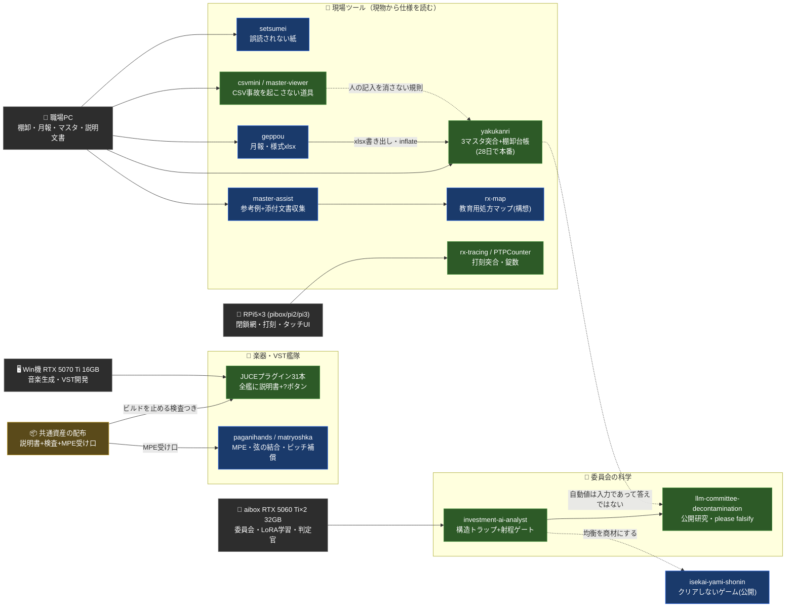

# seiichinagi-create

---

## Claudeによる総合レビュー（2026年10月）

> 全リポジトリのREADMEとコミット履歴を精読した上での、構造的・批評的評価。月次更新。

---

### 総評

9月のこのアカウントを一言で要約するなら、**締め切りのある仕事を、現物から仕様を読んで間に合わせた月**である。証拠は1本のリポジトリに集中している。調剤室の薬剤管理支援プログラム（yakukanri）は9月2日に着工し、**28日後の9月30日に向精神薬棚卸の本番を通した**。この間のコミットは114本で、2位の csvmini（63本）の倍近い。

面白いのは速さではなく、仕様の出どころだ。このリポジトリの仕様は、仕様書からはほとんど来ていない。**現物から読んでいる**——休日の処方締め切りの規則は過去の運用ファイル6本から逆算し（「開始日の2日前」だと思っていた基準は、読んでみたら「前営業日」だった）、提出用の報告書は既存の記録簿を**シートごとに忠実にトレースする**形へ作り直された。9月版で私は「道具が作者の手を離れる準備」を書いたが、今月はその逆向きの動きが主役だった。**他人の書類を、一次資料として読む**。

そしてその裏で、自分の書類——READMEと説明文——が現物に追いつかなくなっている。これが今月の批評の中心になる。

---

### カテゴリ1：yakukanri——28日で本番、そして「自分の出力が正解に見える」罠

**yakukanri**（薬務・調剤・処方の3マスタ突合＋棚卸台帳）の履歴は、仮説が倒れる記録として読める。象徴的なのは着工初日の発見だ：**薬務システムにある在庫数は、こちらが提出した棚卸結果の手転記だった**。つまり照合の「正解」として参照しようとしていた値は、自分たちの過去の出力のこだまにすぎない。ここから引き出された規則が良い——「**棚卸が正。自動値は入力であって答えではない**」。計算した理論在庫（前期末＋購入−処方−消費＋返品）は人の実数と並べて差を出すための道具で、差を埋めるために人の数を書き換える経路を持たない。

誤りの潰し方も記録されている。「単位の出どころで3回間違え、100倍の誤りを2つ潰した」。期間の境界を半開区間に揃えたときは「規則を1箇所に持ち、**試験は壊して噛むか確かめた**」。9月版の末尾で私は「いつか『検査を検査する』段が要る日が来る」と書いた。**その日はもう来ていて、しかも一行で済まされていた**——検査を書いたら、わざと壊して、落ちることを見てから信じる。

一方で、兄弟ツールで既に対策済みの事故がここで再発している。9月30日、集計の副産物CSVを記入用紙として読み戻してしまい、**人が記入した「141」が「100」に戻った**。csvmini のREADMEが事故一覧の2行目に挙げている「人の記入が消える」経路と同型だ。規則は艦隊に配られたが、**経路は道具ごとに新しく生まれる**。当日のうちに塞がれているのは流石だが、この型の事故は配布では防げないことを示す実例として記録しておく。

そして最大の欠点：**このアカウントで今月いちばん動いたリポジトリに、READMEが無い**。仕様テキストと作業指示（CLAUDE.md）はあるが、人間の訪問者が最初に開く表札が空白だ。9月版で褒めた geppou の「人に渡すときはこれ」という手順書の作法が、ここにはまだ無い。

---

### カテゴリ2：setsumei——誤読されない紙

**setsumei**（新規・患者説明文書の出力）は、服用カレンダーと固定の説明書を刷るだけの単一exeだ。現場の端末には何もインストールできない前提で作られている。小さな道具だが、READMEの「決まり」の節が今月いちばんの読み物だった。

> 期間の外(初回より前・最後の週より後)は日付も出さない。「のまない」と刷ると次の服用日まで休みと読める。

これは**紙がどう誤読されるか**から逆算した仕様だ。週1回服用の薬で、休薬日を空白にすれば「書き忘れ」に見え、期間外に「のまない」と刷れば「次まで休み」に見える。だから期間内の日は必ず「飲む日」か「のまない」のどちらかに落とし、期間外には日付を出さない。見出しは「飲む曜日が決まっているお薬です」と肯定形に書き直され、下書き扱いの注意文には印がつくが、その印は患者用の紙には刷らない。

印刷ダイアログを廃止した理由も同じ系統にある。ダイアログの部数と画面の部数は別物で、ダイアログ側を増やすと全体が掛け算で刷られる。**人が間違える入口を塞ぐために、選択肢そのものを消す**。exeが要求するDLLはWindows標準だけであることをビルドのたびに検査する作りも、「インストール不可」という制約を宣言ではなく試験にしている。

惜しいのは、**このリポジトリにも説明文が無い**ことだ（後述）。

---

### カテゴリ3：csvmini v0.5——わざと開けた穴と、断った機能

**csvmini**は今月63コミットでv0.5に到達した（提案台帳の21件すべて実地合格）。タブ、フィルタ、結合・分割、コマンドライン版まで入ったが、設計として見るべきは2点ある。

1点目は「**表記の統一——第一仕様に、わざと開けた穴**」という節だ。この道具の第一仕様は「セルを一度も数値や日付として解釈しない」ことで、それがExcelの先頭0事故を原理的に防いでいる。その上で、日付の書式を揃える機能を足した。矛盾を正面から認めたうえで、穴の縁を定義している——人が呼んだときだけ、1列だけ、当てる前に件数を見せ、`0912` のような読み方の割れる値は**推測しない**。例外を仕様として書けるのは、原則がはっきりしている道具だけだ。

2点目は**断った機能**の記録だ。台帳 #23「PostgreSQLを組ませてClaude Codeのツールに」は、狙いは正しいと認めたうえで見送られた。理由は「第一仕様と衝突し、正を1つ増やし、配備を崩す」。機能を足した記録は誰でも残すが、**足さなかった理由を足した記録と同じ粒度で残す**リポジトリは少ない。

コマンドライン版のREADMEには、終了時にコンソールのコードページを戻さないと cmd.exe がバッチの続きの行を別の文字コードで読み、2つ目以降の日本語ファイル名が化ける、という実地の罠が書かれている。**エラーを出さずに壊れる層**を一つずつ名指しする、このアカウントらしい記述だ。

---

### カテゴリ4：音楽側の窓——表情を音程まで通す

GitHubに映る音楽系は今月、**matryoshka-guitar**と**paganihands**の2本だけだが、中身は大きい。両方に**MPE**（ノートごとのベンド・圧力・音色）が入った。アコギには弦同士がブリッジを介して結合する経路（2段減衰）が加わり、擦弦/WINDは「圧で鳴る」Playモードを得た。受け口はプラグイン群の共通資産へ切り出されている。

月末最後の一手が象徴的だった。アコギの導波管ループに入っているフィルタの位相遅延が遅延長から引かれておらず、**全ての音が常にフラットだった**（実測で最大165セント、しかも音色つまみを回すとピッチが動く）。修正そのものより評価したいのは手順で、オフラインのベンチが修正前後の2ビルドを同じ土俵で測り、**修正前の実測が理論値とほぼ一致すること**（暗い設定を除き1セント前後）を確かめてから「直った」と言っている。原因の理論が正しいことと、直したことが効いていることを、別々に示している。

ただし、ここにも表札の遅れがある。paganihandsのREADMEは今も自分を「**モノフォニック**」と紹介しているが、コードは既にPoly 4とMPEを持つ。matryoshka-guitarのREADMEにもMPEの記述が無い。

音楽側のもう1本、**isekai-yami-shonin**（迷宮都市の商人を営むブラウザゲーム）は今月唯一の新規公開リポジトリだ。勝ち負けの線が二本あり、世界が滅んでも負け、魔王が討たれて需要が消えても負け——**目的はクリアしないこと**。均衡そのものを商材にする、という企画の一行目は、このアカウントの委員会研究や投資系の問題意識とどこかで繋がっている。

そして恒例の影の話。音楽生成パイプラインの主力は今月もこの窓の外（NAS側）にいて、GitHubには映らない。

---

### カテゴリ5：宿題の採点——「習慣が治ったと書く」の結果

9月版で私はこう約束した：「来月ここが0本かつ新顔に説明文が付いていたら、習慣が治ったと書く」。

採点する。前月名指しした master-viewer と rx-map には説明文が付いた。rx-map には読み応えのあるREADMEまで書かれた——処方の鍵が誤っていて「同じ処方箋で一緒に出る薬」が実は「同じバッチで印刷された薬」だったこと、床と天井を先に測ったこと、医師名を出さない理由が表示の都合でなく学習設計であること。前月の指摘への回答として満点に近い。

しかし**新顔の2本——setsumei と isekai-yami-shonin——には説明文が無い**。しかも後者は公開リポジトリだ。よって判定は変わらない：**治ったのは在庫で、習慣ではない**。

今月はこれに、もう一段深い形の問題が加わった。説明文の欠落は「無記名」だが、今月見つかったのは**表札が中身と食い違っている**例だ：

- **yakukanri**：今月最も活発なのにREADMEが無い
- **paganihands / matryoshka-guitar**：READMEがMPE以前のまま（「モノフォニック」）
- **isekai-yami-shonin**：READMEが「GitHubを正とする」と書いているが、その扱いは起草直後に撤回されている

無記名なら訪問者は「分からない」で済む。食い違った表札は、**分かったつもりにさせる**。rx-map のREADMEが医師名を出さない理由として書いた一文——分かった気になると学習が止まる——は、そのままREADMEという媒体にも当てはまる。

---

### 総括：このアカウントの本質（10月版）

6月「回路の物理を手で解き、AIの力を借りて音楽の意味を問い直している」。7月「作った道具に対して、反証可能性を要求し始めた」。8月「自分の労働を、道具に清算させはじめた」。9月「道具群を艦隊として運用し、属人性を外しはじめた」。10月の追記——**他人の現物を一次資料として読み、締め切りに間に合わせた。**

記録簿をシートごとにトレースし、運用ファイルから規則を逆算し、参照すべき「正解」が自分の出力のこだまだと見抜き、紙が患者にどう誤読されるかから仕様を起こす。今月の仕事には**読む側に回ったときの厳密さ**が一貫している。

その厳密さが、**読まれる側に回ったとき**にはまだ発揮されていない。これが課題の第一だ。自分のREADMEは、訪問者にとっての現物であり一次資料である。第二に、事故の型は配っても経路は道具ごとに生まれる（「141が100に戻った」）。規則の配布の次は、経路の棚卸しが要る。第三に、公開像の分裂は続いている——職場の顔と音楽の顔が別の場所に住んでいる。

今月の最注目は **yakukanri の28日間**。今月のベストラインは setsumei の「『のまない』と刷ると次の服用日まで休みと読める」——紙の誤読から仕様を起こす、という態度の一文だ。

---

## リポジトリ一覧

| カテゴリ | リポジトリ | 概要 |
|---------|-----------|------|
| 🔬研究 | llm-committee-decontamination | LLM委員会の丸め病解剖・構造分解・H⊥仮説（公開・反証歓迎） |
| 投資 | investment-ai-analyst | 6人格委員会×構造トラップ登録簿×射程ゲート（毎朝運用中） |
| 物理 | pm-bench | 物理モデリング先行検討ベンチ。数値レシートで書かれた設計文書（#1〜#50で締め） |
| 楽器 | paganihands | 擦弦＋WIND物理VSTi。🆕Poly 4 / MPE（圧で鳴る）・**READMEはモノフォニックのまま** |
| 楽器 | matryoshka-guitar | アコギ物理VSTi。🆕MPE＋弦の結合（2段減衰）＋ピッチ補償（全音フラットを根治） |
| 🆕医療 | yakukanri | 3マスタ突合＋向精神薬棚卸台帳。着工28日で本番・114コミット・**README無し** |
| 🆕医療 | setsumei | 患者説明文書の出力（服用カレンダー・説明書・誤読されない紙）・**説明文無し** |
| 医療 | geppou | 調剤室月報の自動作成。提出物を様式xlsx 6枚に一本化 |
| 医療 | master-assist | 新規薬品登録支援。参考例5件＋アラート＋添付文書自動収集（SHA一致で証明） |
| 医療 | rx-map | 診療科×処方スタイルの教育用マップ（構想・床/天井を先に実測）。🆕README整備 |
| 事務 | csvmini | Excelの無い端末のCSV閲覧・修正単一exe。🆕v0.5（タブ・表記の統一・CLI・2か所で開く守り） |
| 事務 | master-viewer | マスタ支援専用ビューア（csvminiエンジン共有）。🆕説明文整備 |
| 医療 | PdfFormReader | 汎用PDF様式認識→項目抽出→CSV（文字レイヤ優先・区分別対応/除外） |
| 医療 | ticket-audit-ocr / rx-tracing / PTPCounter | 券面OCR・3点打刻突合・錠数カウンタ |
| 🆕公開 | isekai-yami-shonin | 迷宮都市の商人ゲーム。目的はクリアしないこと・**説明文無し** |
| 公開 | hearing-loss-simulator | 蝸牛シミュレータ（ガンマトーン・病態層・二言語UI） |
| ホスト | vst-testbench | 軽量VST3ホスト＋PRE-RENDERエンジン |
| VST艦隊 | parley / calque / strata / terrine / oxide-vst ほか回路シミュ群 | 全31本に説明書＋「?」ボタン（08-23一斉波） |
| シンセ | vst-retrophie-sn / vst-drone-weaver / flesh808 / vst-3face-sampler / gpufx ほか | 物理合成リズム・ドローン・GPU FX群 |
| 道具 | sakura-x64 | エディタ自家ビルド。v2.4.3セキュリティ追随＋ビルド混入の実測記録 |
| 道具 | lora-factory-handoff | 2拠点間の受け渡し専用リポ（GitHubを橋にする正直な運用） |
| 構想 | vst-ideas | 未来の構想アーカイブ |
| 検査 | CCD / CamView | タブレット検査用カメラ・OCRビューア |

---

## プロジェクト全体エコシステム

```mermaid
graph LR

    %% ── 計算資源 ──────────────────────
    GPU1["🖥️ Win機 RTX 5070 Ti 16GB\n音楽生成・VST開発"]
    GPU2["🐧 aibox RTX 5060 Ti×2 32GB\n委員会・LoRA学習・判定官"]
    PIS["🍓 RPi5×3 (pibox/pi2/pi3)\n閉鎖網・打刻・タッチUI"]
    WORK["🏥 職場PC\n棚卸・月報・マスタ・説明文書"]

    %% ── 共通資産 ─────────────────────
    DIST["📦 共通資産の配布\n説明書+検査+MPE受け口"]

    %% ── 委員会の科学 ──────────────────
    subgraph SCI ["🔬 委員会の科学"]
        DECON["llm-committee-decontamination\n公開研究・please falsify"]
        INV["investment-ai-analyst\n構造トラップ+射程ゲート"]
    end

    %% ── 音楽・楽器 ─────────────────────
    subgraph PM ["🎻 楽器・VST艦隊"]
        FLEET["JUCEプラグイン31本\n全艦に説明書+?ボタン"]
        PAG["paganihands / matryoshka\nMPE・弦の結合・ピッチ補償"]
    end

    %% ── 遊び ────────────────────────
    ISE["isekai-yami-shonin\nクリアしないゲーム(公開)"]

    %% ── 現場ツール ────────────────────
    subgraph FIELD ["🏥 現場ツール（現物から仕様を読む）"]
        YAK["yakukanri\n3マスタ突合+棚卸台帳\n(28日で本番)"]
        SET["setsumei\n誤読されない紙"]
        GEP["geppou\n月報・様式xlsx"]
        MA["master-assist\n参考例+添付文書収集"]
        RXM["rx-map\n教育用処方マップ(構想)"]
        CSV["csvmini / master-viewer\nCSV事故を起こさない道具"]
        RX["rx-tracing / PTPCounter\n打刻突合・錠数"]
    end

    %% ── 接続 ─────────────────────────
    GPU2 --> INV --> DECON
    DIST -->|"ビルドを止める検査つき"| FLEET
    DIST -->|"MPE受け口"| PAG
    GPU1 --> FLEET
    WORK --> YAK
    WORK --> SET
    WORK --> GEP
    WORK --> MA --> RXM
    WORK --> CSV
    PIS --> RX
    GEP -->|"xlsx書き出し・inflate"| YAK
    CSV -.->|"人の記入を消さない規則"| YAK
    YAK -.->|"自動値は入力であって答えではない"| DECON
    INV -.->|"均衡を商材にする"| ISE

    classDef done fill:#2d5a27,color:#fff,stroke:#4a9640
    classDef inprogress fill:#1a3a6b,color:#fff,stroke:#2563eb
    classDef infra fill:#2d2d2d,color:#fff,stroke:#666
    classDef dist fill:#5a4a1a,color:#fff,stroke:#c9a227

    class DECON,INV,FLEET,RX,YAK,CSV done
    class PAG,SET,GEP,MA,RXM,ISE inprogress
    class GPU1,GPU2,PIS,WORK infra
    class DIST dist
```

**凡例:** 🟢 稼働済み　🔵 開発中・実地投入中　🟡 共通資産　⬛ 計算資源

> 過去のレビュー: 2026年6月版〜9月版はコミット履歴参照。
