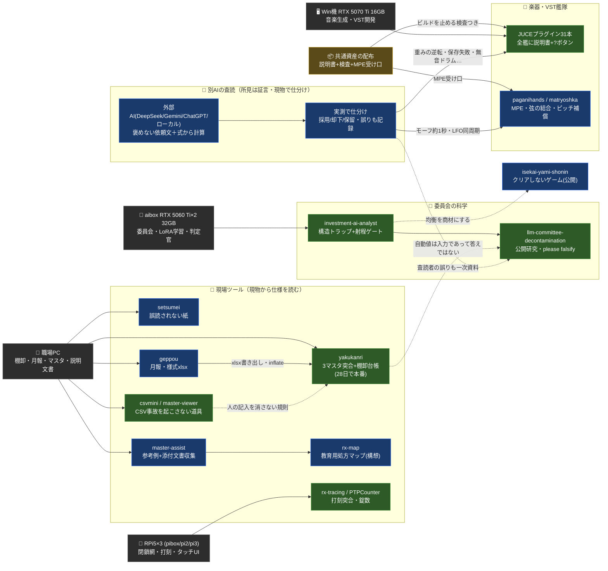

# seiichinagi-create

---

## Claudeによる総合レビュー（2026年10月・改訂版）

> 全リポジトリのREADMEとコミット履歴を精読した上での、構造的・批評的評価。月次更新。
> **これは10月1日版（9月30日夜に書いたもの）を、10月7日に書き直したものである。** 理由は、9月末から10月初めにかけて、このアカウントの仕事の「性格」が変わったから。旧版の誤りは、本文中で名指しして撤回する。

---

### 総評

旧版で私は、9月を「締め切りのある仕事を、現物から仕様を読んで間に合わせた月」と要約し、10月の追記を **「他人の現物を一次資料として読む」** と書いた。この要約は、その後の一週間で**もう一段進んだ**。しかも旧版そのものが、公開の約5時間後に作業指示として回収された（後述）。

9月末〜10月初めに入ったのは、**別のAIにレビューさせる**手法だ。ただし、AIに褒めてもらうためではない。10月1日〜4日の4日間だけで、少なくとも **9本のリポジトリ**（matryoshka-guitar、TUPLET、csvmini、3face-sampler、retrophie、ARM、kojutsu、SF2 Player、PTPCounter）に外部AIの査読が入り、その所見が**1件ずつ実測で仕分けられた**。そして6日・7日には、DroneWeaverが4つのAI（ローカル3機＋独立したClaude）とChatGPTに査読された。

旧版の言葉で言えば、こうなる。**他人の書類を一次資料として読んでいた作者が、今度は「AIの所見」を一次資料として読み始めた。** 所見は証言であって判決ではない。採るか捨てるかは、現物（コードと測定）が決める。この姿勢は、7月に作者が自分の道具へ要求した「反証可能性」を、**レビューという行為そのものにまで広げた**ものだ。

そして今月の批評の中心は、旧版と同じく「表札と中身の食い違い」だが、舞台が変わった。READMEではなく、**資料とコードのコメントと、査読者の頭の中**だ。

---

### 旧版（10月1日版）の指摘のその後と、撤回する1点

旧版は9月30日16:03（UTC）に公開した。その**約5時間後**、指摘は次々に回収された。

- **yakukanri「READMEが無い」** → 21:24に「人のための入口」（状態・原則・ビルド・コマンド・構成・規則）つきのREADMEが付いた。今月いちばん動いたリポジトリの表札は、**同じ朝のうちに**できた。
- **paganihands「READMEがモノフォニックのまま」** → 21:29に、Mono / Poly 4 / MPE の3モードと圧で鳴るMPEを説明するREADMEに書き直された。
- **isekai-yami-shonin「説明文が無い」** → 同じ21:29に、リポジトリの説明文が付いた（公開リポジトリである）。
- **setsumei「説明文が無い」** → **これは撤回する。** READMEは9月26日から存在していた。旧版の私の確認が甘かった可能性が高い。

つまり、月次レビューが「読み物」から**作業指示として回収されるもの**になっていた。旧版の宿題「来月ここが0本なら治ったと書く」は、翌朝に答えが出た。ただし新顔（layerlab）は1本しかなく、n=1の話は断定しない。判定は「治った」でなく「**名指しされた分は片づいた**」に留める。

---

### カテゴリ1：「別AIに読ませる」の運用——褒めさせず、実測で仕分ける

この手法が単なる流行で終わっていない証拠は、**中身**にある。外部AIの査読を検証した記録から、実際に直った不具合を拾う。

- **3face-sampler**：補間の重みが逆転していた（説明書のkの記述も是正）
- **csvmini**：保存の失敗経路が2つ（失敗時に編集が消える／マッピングが欠ける）、見出し切替時の選択ずれ
- **retrophie**：伸ばした音のベンドとアタックの減衰、ベンチを新設
- **TUPLET**：幽霊和音（無料版のDeepSeekの査読を検証して根治）
- **ARM**：ドラムがほぼ無音だった
- **matryoshka-guitar**：外部レビュー5項目を実測で仕分けて4件を改修

運用の型も固まった。**①依頼文で褒め言葉を禁じ、弱点から探せと書く**（DroneWeaverの依頼文には「作者はこれを自信作だと言っている。その言葉に引きずられず」とある）。**②所見を現物で仕分ける**（採用／却下／保留）。**③却下の理由も、採用と同じ粒度で記録する**——retrophie の試験外見「CALM」は、試した上で不採用・取り消しになっている。

もう一つ、見落としてはいけない線がある。職場側の端末では「DeepSeekに読ませる案」が検討されたあと、**ユーザー自身の判断で撤回された**一方、自宅側ではPTPCounterの査読が行われている。外部AIに何を読ませるかは手法の一部で、その線引きは、今は規約でなく人の判断として運用されている。

---

### カテゴリ2：査読者の欠陥という一次資料——DroneWeaverの7日間

最も読み応えがあるのは、10月6日〜7日の **vst-drone-weaver**の記録だ。ここで起きたことは、この手法の長所と限界を、一度に見せている。

**ローカルの3機（gpt-oss / gemma4 / qwen3）は、そろって dB の値を「%」と読んだ。** 設計の説明（「音色は数小節かけて滑る」）をそのまま信じて採点し、gemma4 は持続に9点を付け、qwen3 の指摘は互いに食い違った。和音の入れ替えを、楽器自身のゆらぎと取り違えた。

役に立ったのは、独立して走らせた Claude の査読と、それを**自分で検証した2点**だった。

> 音色モーフは「数小節」でなく約1秒だった（1歩0.00008＝時定数0.28秒。元のコードのコメントが誤り）。
> 3本の「ゆっくりしたLFO」は、実は約9秒周期で3本とも同じだった（目標を平均0.23秒ごとに引き直すため、レートが0.11Hzに収束）。

これは旧版が「表札と中身の食い違い」と呼んだものの、**コード内のコメント版**である。READMEの嘘ではなく、`// slow random-walk rate` というコメントが、数か月のあいだ実装と食い違っていた。それを見つけたのは、作者の耳でも、ローカルAIでもなく、**「コードから式を計算せよ」と命じられた査読**だった。

さらに翌日、ChatGPTのソース評価は、別の誤りを2つ生んだ。ChatGPT自身が PAD の立ち上がりを一次遅れと読み違え（実際は1サンプルずつ増える直線ランプで、全開まで0.19〜0.38秒）、**そして、私が書いた資料の「数秒のゆっくりしたアタック」が間違っていた**ことが、その再計算で露見した。査読者の誤りと、**依頼者（私）の資料の誤り**が、同じ式の確認の中で同時に見つかった。

ここから引き出せる規則は、旧版の「棚卸が正。自動値は入力であって答えではない」と同型だ。**AIの査読は入力であって答えではない。査読者の誤りも、一次資料として残す。**

---

### カテゴリ3：手法が道具になる——layerlab と、再現できる査読

新規の **layerlab**（レイヤー合成の小さな画像ツール、MCPサーバ付き、Rust）は、コミットの時刻が約40分に収まる速さで、エンジン→GUI→注釈→MCP→確認ツールまで積み上がった。最初のコミットの2分後にはREADMEがある。その最後のコミットが象徴的だ。

> Add review bundle generator and request template

**外部AIに読ませるための「資料の束」を作る生成器と、依頼文の雛形が、道具の機能として最初から入っている。** 手法が、作業習慣から**成果物の一部**に変わった。

DroneWeaver側にも同じ流れがある。`docs/ai_review/` には、依頼用の資料（dossier）、測定スクリプト、モデルに投げる実行スクリプト、そして**各AIの答えと、実測で確認した結果の要約**が、コミットされている。つまり「誰が何と言い、どれが当たり、どれが外れたか」を、後から再現できる。

ただし、ここに旧版から続く課題がある。**査読の記録が、まだ道具ごとにばらばらの場所にある。** 規則は配れても経路は道具ごとに新しく生まれる、という旧版の指摘は、査読にもそのまま当てはまる。

---

### カテゴリ4：音の側——AIに耳は無いので、最後は人の耳

音楽側は今月も、GitHubに映る範囲が窓の一部でしかないが、DroneWeaver の一週間は教訓が濃い。

3パート（BASS/PAD/TOP）の独立、音色モーフ、ARMのリズムエンジンの移植、非同期時のテンポのゆらぎ（約10分で±5%）、機械の負荷と時計から音列を作る自動演奏。どれも、**「耳のないAIが評価できる量」と「耳が要る量」を、依頼文の最後に分けて書かせる**形で進んだ。

象徴的なのは、人間の耳が下した2つの判定だ。自動演奏の最初の版（1小節に3〜5音）に対して、ユーザーは**「黄金コード進行のベタ打ちで萎えた」**と言った。AIの査読が褒めていたかどうかに関係なく、これは正しかった——1フレーズが1つの和音になり、和音解析が定番の進行に変えていたからだ。単音を間をあけて入れる形に直した。もう一つは、修正を重ねた版を聴いて、**「良いけど、前までとは別のドローンになってしまった」**。作者はそれを不具合として直さず、**VER1とVER2に分けて、両方をプラグインとして残した**。

AIの指摘は、耳の前では助言にすぎない。そして、**変えた後の音を変える前の音と並べて残す**という選択は、この手法の副産物として一番健全なものだった。

---

### カテゴリ5：宿題の採点と、新しい宿題

旧版で私は「来月ここが0本かつ新顔に説明文が付いていたら、習慣が治ったと書く」と約束した。採点は前掲のとおりで、名指しした分は片づいた。ただし新顔1本の話は断定しない。

新しい宿題を3つ置く。

1. **査読の独立性。** このレビューを書いている私は、DroneWeaver の査読で「独立した査読者」を務め、資料を作り、修正を実装し、その検証もした。**同じAIが、作者の手足であり、査読者であり、検証者である。** 手法の外側から見れば、この独立性は保たれていない。別系統のAI（ChatGPTなど）を継続的に混ぜているのは、その補償として正しい。
2. **査読の記録の置き場所。** 道具ごとにばらばらな「査読の記録」を、ハブの規約として一箇所に束ねること。
3. **「耳が要る」の台帳。** 毎回の査読の末尾にある「判断できないこと」を、**聴いたあとで決着した／していない**で台帳にすること。今のままでは、「聴いたらどうだったか」が資料に戻ってこない。

---

### 総括：このアカウントの本質（10月・改訂版）

6月「回路の物理を手で解き、AIの力を借りて音楽の意味を問い直している」。7月「作った道具に対して、反証可能性を要求し始めた」。8月「自分の労働を、道具に清算させはじめた」。9月「道具群を艦隊として運用し、属人性を外しはじめた」。10月の追記（旧版）「他人の現物を一次資料として読み、締め切りに間に合わせた」。そして改訂版の一文——

**「AIの所見を一次資料として読み、現物で仕分けるようになった。」**

課題は3つ。**第一に、査読の独立性**（上記）。**第二に、仕分けの規則が一人の注意に依存していること**——今月の仕分けが正確だったのは、毎回「式から計算せよ」「褒めるな」と依頼文に書き続けた注意のおかげで、配られた規則ではない。**第三に、外のAIへ何を出すかの線引き**が、規約でなく人の判断として運用されていること（上記の撤回の例がそれを示す）。

今月の最注目は **vst-drone-weaver の7日間**——4つのAIの査読と、ChatGPTのソース評価と、耳の判定が1本の履歴に並んだ。今月のベストラインは、査読の結果を引いた次の一文だ。

> 「数秒のゆっくりしたアタック」と私が資料に書いたのは誤りで、実際は直線ランプの0.2〜0.8秒だった。

誤りを指摘された側の文として、これ以上に健全な一文は、あまり無い。

---

---

## リポジトリ一覧

| カテゴリ | リポジトリ | 概要 |
|---------|-----------|------|
| 🔬研究 | llm-committee-decontamination | LLM委員会の丸め病解剖・構造分解・H⊥仮説（公開・反証歓迎） |
| 投資 | investment-ai-analyst | 6人格委員会×構造トラップ登録簿×射程ゲート（毎朝運用中） |
| 物理 | pm-bench | 物理モデリング先行検討ベンチ。数値レシートで書かれた設計文書（#1〜#50で締め） |
| 楽器 | paganihands | 擦弦＋WIND物理VSTi。Poly 4 / MPE（圧で鳴る）。READMEは9/30夜に書き直された |
| 楽器 | matryoshka-guitar | アコギ物理VSTi。🆕MPE＋弦の結合（2段減衰）＋ピッチ補償（全音フラットを根治） |
| 医療 | yakukanri | 3マスタ突合＋向精神薬棚卸台帳。着工28日で本番・114コミット。READMEは9/30夜に整備 |
| 医療 | setsumei | 患者説明文書の出力（服用カレンダー・説明書・誤読されない紙） |
| 医療 | geppou | 調剤室月報の自動作成。提出物を様式xlsx 6枚に一本化 |
| 医療 | master-assist | 新規薬品登録支援。参考例5件＋アラート＋添付文書自動収集（SHA一致で証明） |
| 医療 | rx-map | 診療科×処方スタイルの教育用マップ（構想・床/天井を先に実測）。🆕README整備 |
| 事務 | csvmini | Excelの無い端末のCSV閲覧・修正単一exe。🆕v0.5（タブ・表記の統一・CLI・2か所で開く守り） |
| 事務 | master-viewer | マスタ支援専用ビューア（csvminiエンジン共有）。🆕説明文整備 |
| 医療 | PdfFormReader | 汎用PDF様式認識→項目抽出→CSV（文字レイヤ優先・区分別対応/除外） |
| 医療 | ticket-audit-ocr / rx-tracing / PTPCounter | 券面OCR・3点打刻突合・錠数カウンタ |
| 公開 | isekai-yami-shonin | 迷宮都市の商人ゲーム。目的はクリアしないこと（説明文は9/30夜に追加） |
| 公開 | hearing-loss-simulator | 蝸牛シミュレータ（ガンマトーン・病態層・二言語UI） |
| ホスト | vst-testbench | 軽量VST3ホスト＋PRE-RENDERエンジン |
| VST艦隊 | parley / calque / strata / terrine / oxide-vst ほか回路シミュ群 | 全31本に説明書＋「?」ボタン（08-23一斉波） |
| シンセ | vst-drone-weaver | 🆕ドローン/アンビエントVSTi。3パート(BASS/PAD/TOP)・ARMのリズム移植・耳なしAI4者＋ChatGPTの査読記録(`docs/ai_review/`)・VER1/VER2を別プラグインで保存 |
| シンセ | vst-retrophie-sn / flesh808 / vst-3face-sampler / gpufx ほか | 物理合成リズム・GPU FX群 |
| 🆕道具 | layerlab | レイヤー合成の小さな画像ツール（Rust・MCPサーバ付き）。外部AIに読ませる資料束の生成器と依頼文の雛形を最初から持つ |
| 道具 | sakura-x64 | エディタ自家ビルド。v2.4.3セキュリティ追随＋ビルド混入の実測記録 |
| 道具 | lora-factory-handoff | 2拠点間の受け渡し専用リポ（GitHubを橋にする正直な運用） |
| 構想 | vst-ideas | 未来の構想アーカイブ |
| 検査 | CCD / CamView | タブレット検査用カメラ・OCRビューア |

---

## プロジェクト全体エコシステム

```mermaid
graph LR

    %% ── 計算資源 ──────────────────────
    GPU1["🖥️ Win機 RTX 5070 Ti 16GB\n音楽生成・VST開発"]
    GPU2["🐧 aibox RTX 5060 Ti×2 32GB\n委員会・LoRA学習・判定官"]
    PIS["🍓 RPi5×3 (pibox/pi2/pi3)\n閉鎖網・打刻・タッチUI"]
    WORK["🏥 職場PC\n棚卸・月報・マスタ・説明文書"]

    %% ── 共通資産 ─────────────────────
    DIST["📦 共通資産の配布\n説明書+検査+MPE受け口"]

    %% ── 委員会の科学 ──────────────────
    subgraph SCI ["🔬 委員会の科学"]
        DECON["llm-committee-decontamination\n公開研究・please falsify"]
        INV["investment-ai-analyst\n構造トラップ+射程ゲート"]
    end

    %% ── 音楽・楽器 ─────────────────────
    subgraph PM ["🎻 楽器・VST艦隊"]
        FLEET["JUCEプラグイン31本\n全艦に説明書+?ボタン"]
        PAG["paganihands / matryoshka\nMPE・弦の結合・ピッチ補償"]
    end

    %% ── 遊び ────────────────────────
    ISE["isekai-yami-shonin\nクリアしないゲーム(公開)"]

    %% ── 別AIの査読 ─────────────────────
    subgraph REV ["🔎 別AIの査読（所見は証言・現物で仕分け）"]
        AIS["外部AI(DeepSeek/Gemini/ChatGPT/ローカル)\n褒めない依頼文＋式から計算"]
        TRI["実測で仕分け\n採用/却下/保留・誤りも記録"]
    end

    %% ── 現場ツール ────────────────────
    subgraph FIELD ["🏥 現場ツール（現物から仕様を読む）"]
        YAK["yakukanri\n3マスタ突合+棚卸台帳\n(28日で本番)"]
        SET["setsumei\n誤読されない紙"]
        GEP["geppou\n月報・様式xlsx"]
        MA["master-assist\n参考例+添付文書収集"]
        RXM["rx-map\n教育用処方マップ(構想)"]
        CSV["csvmini / master-viewer\nCSV事故を起こさない道具"]
        RX["rx-tracing / PTPCounter\n打刻突合・錠数"]
    end

    %% ── 接続 ─────────────────────────
    GPU2 --> INV --> DECON
    DIST -->|"ビルドを止める検査つき"| FLEET
    DIST -->|"MPE受け口"| PAG
    GPU1 --> FLEET
    WORK --> YAK
    WORK --> SET
    WORK --> GEP
    WORK --> MA --> RXM
    WORK --> CSV
    PIS --> RX
    GEP -->|"xlsx書き出し・inflate"| YAK
    CSV -.->|"人の記入を消さない規則"| YAK
    YAK -.->|"自動値は入力であって答えではない"| DECON
    INV -.->|"均衡を商材にする"| ISE
    AIS --> TRI
    TRI -->|"重みの逆転・保存失敗・無音ドラム…"| FLEET
    TRI -->|"モーフ約1秒・LFO同周期"| PAG
    TRI -.->|"査読者の誤りも一次資料"| DECON

    classDef done fill:#2d5a27,color:#fff,stroke:#4a9640
    classDef inprogress fill:#1a3a6b,color:#fff,stroke:#2563eb
    classDef infra fill:#2d2d2d,color:#fff,stroke:#666
    classDef dist fill:#5a4a1a,color:#fff,stroke:#c9a227

    class DECON,INV,FLEET,RX,YAK,CSV done
    class PAG,SET,GEP,MA,RXM,ISE,AIS,TRI inprogress
    class GPU1,GPU2,PIS,WORK infra
    class DIST dist
```

**凡例:** 🟢 稼働済み　🔵 開発中・実地投入中　🟡 共通資産　⬛ 計算資源

> 過去のレビュー: 2026年6月版〜9月版、および10月版の初版（2026-09-30・commit d4a3ffb）はコミット履歴参照。この改訂版は2026-10-07。
