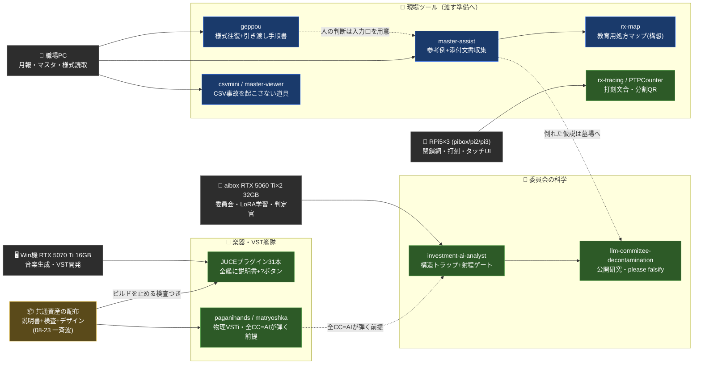

# seiichinagi-create

---

## Claudeによる総合レビュー（2026年9月）

> 全リポジトリのREADMEを精読した上での、構造的・批評的評価。月次更新。

---

### 総評

8月のこのアカウントを一言で要約するなら、**個々の道具の改良ではなく、道具群の「運用」が始まった月**である。証拠は8月23日にある。この日、20本を超えるVSTリポジトリが一斉に動いた。新機能ではない。**全プラグインに使用説明書と「?」ボタンが埋め込まれた**のだ。説明書はバイナリの中に焼かれ（隣に置いたファイルは消える経路が3つあり、どれもエラーを出さない）、しかも腐り止めが**ビルドを止める形**で実装されている——出荷済みVST3を読んでパラメータを列挙し、説明書に書かれていないつまみがあると説明書のビルドが落ちる。散文にして約400パラメータぶん。ドキュメントを「書く」のではなく「検査対象の成果物」として扱う個人開発を、私は他に知らない。

もう一つの動きは職場側にあり、こちらの主題は**継承**だ。月報作成ツール（geppou）には「知らない薬剤師が一通り出力できる」ための手順書と、**道具を他人に渡すときの章**が書かれた。渡すものの一覧に「渡してはいけないもの」（患者情報を含む過去データ）が明記されている。マスタ登録支援（master-assist）には、倒れた仮説を葬る「墓場」つきの次回手順メモがある。7月が「反証」、8月が「清算」なら、この1か月は**配布と継承**——道具が作者の手を離れる準備を始めた月である。

---

### カテゴリ1：8月23日の一斉波——説明書をバイナリへ溶接する

この日の一斉更新は、外から見ると単なる「ドキュメント追加」に見える。中身は逆で、**ドキュメントの側に検査が付いた**。仕組みは2つの継ぎ目でできている：原稿とプラグイン実体の突合（書き忘れたつまみで落ちる）、そして**建った成果物と原稿の突合**（焼き直しを忘れると落ちる）。PDF生成ではheadlessブラウザが「exit 0・無出力」という成功の顔をした無反応を返すことを突き止め、通常のブラウザをDevToolsプロトコルで駆動する方に倒している。

このロールアウト自体が検査の教材になっているのが面白い。配布先リストに漏れた5本を「リストから配る」のではなく**「持っている側から探す」**ことで検出し、名前空間の衝突でドラム音源のリズム資産63本が成果物から静かに消えていたのをRIFFチャンク数（3→66）で捕まえている。**ビルドが通ることと、成果物が正しいことは別**——このアカウントが何度も授業料を払って学んだ命題が、今回は防具として全艦に配られた。

---

### カテゴリ2：geppou——Excelとの往復、そして手放す準備

**geppou**（調剤室月報・依存なし単一exe）は今月、様式との往復を完成させた。人がExcelでレイアウトを整えた様式ファイルを受け取り、**毎月値だけを差し替える**。設計の芯はセルの対応づけを「値」でやらないこと——月報の数値26個のうち**16個は構造的に重複する**（時間外の内訳が1種しかないので「内訳」と「計」が必ず等しい）ため、値では一意に決まらない。答えはExcelの「名前の定義」で、列の挿入にも追随する。

技術的な見どころは**RFC1951のinflateを自前実装しつつ、deflateは書かなかった**判断だ。ZIPは部品ごとに圧縮方式を選べるので、触らない部品は圧縮のまま丸ごと写す（実測で12パート中11がバイト一致）。必要なものだけを作る、の教科書的な適用である。検査は三段構え（ソース検査・XML構造検査・**Excel自身に開かせる検査**）で、三段目が実際にバグを捕まえた——fonts count=5と宣言してfont要素が3つ、というビルドもZIPもXMLも値の一致もすり抜ける壊れ方は、Excelの「修復」発動でしか見えなかった。リファクタ後に**全出力22ファイルのバイト一致**を示してから完了と言う流儀は今月も健在。

そして手順書。渡すのはexeと設定フォルダの2つだけ、過去の処方データは渡さない（患者番号・氏名を含む117列と**実測してから**書いてある）、書ける場所に置く、同じ実行フォルダを2人で使わない。**属人化の外し方まで仕様に含めた**業務ツールは、病院の情報部門でもなかなか見ない。

---

### カテゴリ3：master-assist / rx-map——「集めることが本体」への転回

**master-assist**（新規薬品登録支援）のREADMEにある一文が良い：「作るのは『正確で入力しやすい紙』だけ」。システムには書き込まない。正解を断定せず、似た既存薬の実際の入力値を5件見せて人が決める。今月ここに**入力ミス台帳**（7件・経路別）と添付文書の照合が加わった。過程で仮説が5つ実測に倒れ（「メーカー共通の刻印接頭辞がある」等）、倒れた仮説は手順メモの**「墓場」**に葬られている——また思いつくから、という理由で。検査を緩めると本物の誤りが通ってしまうことも実測で確認済みで（一般名は文書中どこにでも出る）、厳密一致に戻している。

白眉は評価軸の転回だ。当初は「機械が刻印を読めるか」（79%）で成否を測っていたが、実際の失敗例は読字ではなく**別の薬の文書を開いたこと**に起因していた。つまり正しい文書さえ確実に人の前に出れば、失敗の経路そのものが消える。**収集が本体、文字照合は補助**——公的機関からの自動取得は、手で集めたファイルとのSHA-256完全一致で証明してから運用に入れている。

**rx-map**（新規・処方関係マップ）は新人薬剤師の教育用に、自院の処方データから診療科×処方スタイルの地図を作る構想だ。まだコードは薄いが、着工前の実測が既に一仕事している——引き継いだ集計の鍵が誤りで、**「同じ処方箋で一緒に出る薬」と測っていたものは実際には「同じバッチで印刷された薬」だった**（鍵の91.5%が複数患者にまたがる）。床（別診療科の医師＝0.000）と天井（同一医師の別標本＝0.365）を先に測ってから「医師ごとの型は実在する」と言う手順、そして**匿名化を表示の都合でなく学習設計として裁定した**点（名前を覚えると分かった気になる）は、教育ツールの要件定義として出色。ただしこのリポジトリ、**READMEも説明文も無い**。

---

### カテゴリ4：小さい道具の職人芸（csvmini / master-viewer / PTPCounter）

**csvmini**（Excelの無い端末でCSVを見る・直す単一exe）のREADMEは、過去に踏んだCSV事故の一覧とその対策で書かれている。「表せない字があれば場所を言って中止する」「自信が無いときはそう言う」。今月はタブ区切りの`.CSV`に対応した——拡張子は見ず**中身から判定**する。多数決で決めると外れる（カンマで切ると5,771行が「1列で揃っている」ように見える）ので、「列数2以上×行ごとに揃う」の2条件だけで判定する。クラッシュ根治も1件：見出しラベルの固定長バッファが251文字を超えた瞬間にプロセスが消える——**ファイルの大きさは無関係で、733バイトのCSVでも再現する**ことを示してから直している。

**PTPCounter**は、お薬手帳の分割QRを連続読み取りに。原因調査が良い読み物で、「1枚目で読み取りが終了する」の真犯人は**合計枚数の既定値が1だったこと**（1枚受けた時点で「全部揃った」が成立し自分を閉じる）。ハードのバーコードリーダー経由の不具合は「文字化け」と診断しかけて実測で覆り——届いた7件すべて非ASCII 0文字、つまり**化けたのではなく日本語が丸ごと落ちていた**——復元不能なものを繋いで動いているように見せる代わりに、エラーコードで名指しする方を選んだ。そして`qr_probe`：読み取りの実態調査のために「個人情報を書かないモニタ」を作り、**偽の個人情報を流し込んで出力のどこにも現れないことを検査で示す**。プライバシーを主張でなくテストにした好例。

---

### カテゴリ5：宿題の清算と、残る影

前月まで3回指摘し続けた項目に動きがあった。**二重リポジトリは解消**（oxide旧版・BigMuff旧版はアーカイブして転送先を明記。運用終了した音楽スタジオ旧版も移行表つきでアーカイブ——「捨てる」も記録つきでやる流儀）。**説明文なしは15本→2本**まで減った。残る2本は master-viewer と rx-map——つまり在庫は片付いたが、**新しいリポジトリがまた無記名で生まれている**。治ったのは在庫で、習慣ではない。来月ここが0本かつ新顔に説明文が付いていたら、習慣が治ったと書く。

**sakura-x64**は上流のセキュリティ修正（OSコマンドインジェクション含む5件）に追随してv2.4.3へ。自家ビルドの持ち込みは「一度ビルドして終わり」ではなく上流を追う義務を負う、という当然だが誰もやらないことをやっている。ビルド環境からmsys版DLL依存のdiff.exeが成果物に混入した件をSHA-256で突き止めた記録は、`find_program`を使う全ビルド屋が読むべき文書だ。

最後に、恒例の影の話。**音楽側の主力開発は今月もこの窓の外にいる**（NAS側が正）。8月の音楽系はおそらくこのアカウントの見た目の3倍は動いているが、GitHubに映るのは職場ツールと8月23日の波だけだ。このアカウントは実質、**職場の顔**になりつつある——職場ネットからNASに届かないという物理的理由による分業だが、外から見る人はそれを知らない。

---

### 総括：このアカウントの本質（9月版）

6月「回路の物理を手で解き、AIの力を借りて音楽の意味を問い直している」。7月「作った道具に対して、反証可能性を要求し始めた」。8月「自分の労働を、道具に清算させはじめた」。9月の追記——**道具群を艦隊として運用し、属人性を外しはじめた。**

説明書がビルドで検査され、手順書が「渡してはいけないもの」まで規定し、倒れた仮説が墓場に記録され、匿名化が学習設計として裁定される。共通するのは、**未来の他人（と未来の自分）を最初から設計に入れる**態度だ。個人開発の成熟は、開発をやめることではなく、自分がいなくても道具が正しく振る舞い、正しく渡り、正しく疑われるようにすること——この1か月はその工程表に見える。

課題は3つ。第一に、新リポジトリの無記名癖（rx-map / master-viewer）。第二に、公開像の分裂——職場の顔と音楽の顔が別の場所に住み、どちらの訪問者も半分しか見えない。第三に、これは課題というより観察だが、**検査文化の固定費**が増え続けている。selftest数百項目・三段検査・バイト一致証明は今は資産だが、いつか「検査を検査する」段が要る日が来る。今月の最注目は迷わず**8月23日の一斉波**——説明書という最も腐りやすい成果物に、ビルドを止める権限を与えた設計である。

---

## リポジトリ一覧

| カテゴリ | リポジトリ | 概要 |
|---------|-----------|------|
| 🔬研究 | llm-committee-decontamination | LLM委員会の丸め病解剖・構造分解・H⊥仮説（公開・反証歓迎） |
| 投資 | investment-ai-analyst | 6人格委員会×構造トラップ登録簿×射程ゲート（毎朝運用中） |
| 物理 | pm-bench | 物理モデリング先行検討ベンチ。数値レシートで書かれた設計文書（#1〜#50で締め） |
| 楽器 | paganihands | 擦弦＋WIND物理VSTi。演奏補助ノブ（Assist / Auto-play）・全CC対応 |
| 楽器 | matryoshka-guitar | アコギ物理VSTi。8ボイス＋モーダルボディ＋共鳴弦バンク・プリセット32 |
| 医療 | geppou | 調剤室月報の自動作成。🆕様式往復（名前の定義・自前inflate・Excel検査）＋引き渡し手順書 |
| 🆕医療 | master-assist | 新規薬品登録支援。参考例5件＋アラート＋添付文書自動収集（SHA一致で証明） |
| 🆕医療 | rx-map | 診療科×処方スタイルの教育用マップ（構想・床/天井を先に実測・**README無し**） |
| 🆕事務 | csvmini | Excelの無い端末のCSV閲覧・修正単一exe。区切りは中身から判定・事故対策が第一仕様 |
| 🆕事務 | master-viewer | マスタ支援専用ビューア（csvminiエンジン共有・**説明文無し**） |
| 医療 | PdfFormReader | 汎用PDF様式認識→項目抽出→CSV（文字レイヤ優先・区分別対応/除外） |
| 医療 | ticket-audit-ocr / rx-tracing / PTPCounter | 券面OCR・3点打刻突合・錠数カウンタ（🆕分割QR連続読取＋PII不在検査） |
| 公開 | hearing-loss-simulator | 蝸牛シミュレータ（ガンマトーン・病態層・二言語UI） |
| ホスト | vst-testbench | 軽量VST3ホスト＋PRE-RENDERエンジン |
| VST艦隊 | parley / calque / strata / terrine / oxide-vst ほか回路シミュ群 | 🆕全31本に説明書＋「?」ボタン（08-23一斉波・旧oxide/BigMuffはアーカイブ済） |
| シンセ | vst-retrophie-sn / vst-drone-weaver / flesh808 / vst-3face-sampler / gpufx ほか | 物理合成リズム・ドローン・GPU FX群 |
| 道具 | sakura-x64 | エディタ自家ビルド。🆕v2.4.3セキュリティ追随＋ビルド混入の実測記録 |
| 道具 | lora-factory-handoff | 2拠点間の受け渡し専用リポ（GitHubを橋にする正直な運用） |
| 構想 | vst-ideas | 未来の構想アーカイブ |
| 検査 | CCD / CamView | タブレット検査用カメラ・OCRビューア |

---

## プロジェクト全体エコシステム

```mermaid
graph LR

    %% ── 計算資源 ──────────────────────
    GPU1["🖥️ Win機 RTX 5070 Ti 16GB\n音楽生成・VST開発"]
    GPU2["🐧 aibox RTX 5060 Ti×2 32GB\n委員会・LoRA学習・判定官"]
    PIS["🍓 RPi5×3 (pibox/pi2/pi3)\n閉鎖網・打刻・タッチUI"]
    WORK["🏥 職場PC\n月報・マスタ・様式読取"]

    %% ── 共通資産（今月の主役） ─────────
    DIST["📦 共通資産の配布\n説明書+検査+デザイン\n(08-23 一斉波)"]

    %% ── 委員会の科学 ──────────────────
    subgraph SCI ["🔬 委員会の科学"]
        DECON["llm-committee-decontamination\n公開研究・please falsify"]
        INV["investment-ai-analyst\n構造トラップ+射程ゲート"]
    end

    %% ── 音楽・楽器 ─────────────────────
    subgraph PM ["🎻 楽器・VST艦隊"]
        FLEET["JUCEプラグイン31本\n全艦に説明書+?ボタン"]
        PAG["paganihands / matryoshka\n物理VSTi・全CC=AIが弾く前提"]
    end

    %% ── 現場ツール ────────────────────
    subgraph FIELD ["🏥 現場ツール（渡す準備へ）"]
        GEP["geppou\n様式往復+引き渡し手順書"]
        MA["master-assist\n参考例+添付文書収集"]
        RXM["rx-map\n教育用処方マップ(構想)"]
        CSV["csvmini / master-viewer\nCSV事故を起こさない道具"]
        RX["rx-tracing / PTPCounter\n打刻突合・分割QR"]
    end

    %% ── 接続 ─────────────────────────
    GPU2 --> INV --> DECON
    DIST -->|"ビルドを止める検査つき"| FLEET
    DIST --> PAG
    GPU1 --> FLEET
    PAG -.->|"全CC=AIが弾く前提"| INV
    WORK --> GEP
    WORK --> MA --> RXM
    WORK --> CSV
    PIS --> RX
    GEP -.->|"人の判断は入力口を用意"| MA
    MA -.->|"倒れた仮説は墓場へ"| DECON

    classDef done fill:#2d5a27,color:#fff,stroke:#4a9640
    classDef inprogress fill:#1a3a6b,color:#fff,stroke:#2563eb
    classDef infra fill:#2d2d2d,color:#fff,stroke:#666
    classDef dist fill:#5a4a1a,color:#fff,stroke:#c9a227

    class DECON,INV,PAG,FLEET,RX done
    class GEP,MA,RXM,CSV inprogress
    class GPU1,GPU2,PIS,WORK infra
    class DIST dist
```

**凡例:** 🟢 稼働済み　🔵 開発中・実地投入中　🟡 共通資産　⬛ 計算資源

> 過去のレビュー: 2026年6月版〜8月版はコミット履歴参照。
